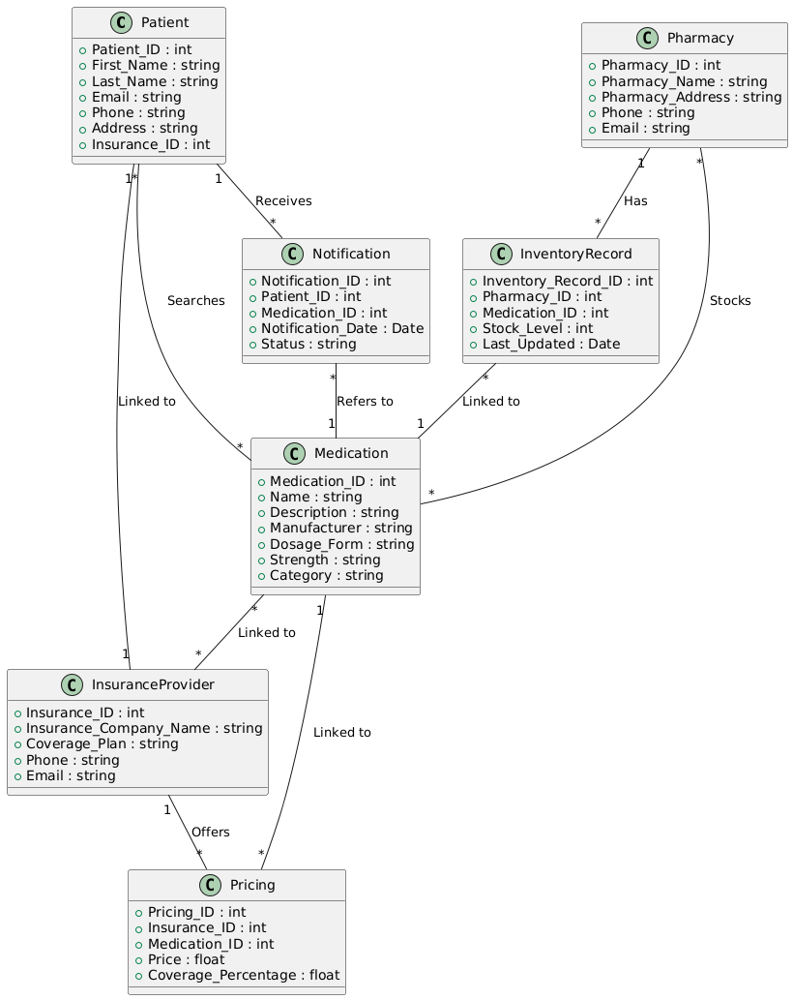

# PharmaConnect : A Database Solution for Medication Access and Inventory Management

## Phase 2: Business Process Modeling (Related to Management Information Systems - MIS)

## 1. Scope of the Project:
The business process being modeled in the PharmaConnect system is the medication search and inventory management process that connects patients and pharmacies through a unified platform. This process addresses the challenges of timely medication access and efficient pharmacy inventory management, aligning with Management Information Systems (MIS) principles by ensuring real-time, data-driven decision-making that optimizes patient experience and pharmacy operations.
### •	Objectives:
 - 	To improve medication accessibility for patients by enabling them to search for available medications at local pharmacies.
 -  To optimize inventory management for pharmacies, ensuring real-time updates of stock levels and accurate availability data.
 - 	To provide cost transparency by integrating insurance providers to offer pricing based on patients’ insurance coverage.
### •	Expected Outcomes:
 - 	Patients can access real-time medication availability, reducing unnecessary trips to pharmacies and increasing convenience.
 - 	Pharmacies achieve improved inventory management, reducing overstocking and stockouts.
 - 	Enhanced patient satisfaction, as they are notified about medications availability and costs.
## 2. Identify Key Entities:
 The key entities involved in the business process are:
### •	Patient:
 - 	Role: Searches for medications, places orders, receives notifications about medication availability, and is linked to insurance providers.
### •	Pharmacy:
 - 	Role: Updates inventory, stocks medications, and provides real-time information about stock availability. It is also linked to insurance providers for pricing adjustments.
### •	Medication:
 - 	Role: The medication being searched for and stocked by pharmacies. The system tracks its availability and pricing across various pharmacies.
### •	Inventory Record:
 - 	Role: Represents the stock information of a specific medication at a particular pharmacy. It links medications to pharmacies and provides real-time data.
### •	Insurance Provider:
 - 	Role: Provides pricing adjustments for medications, which is integrated with pharmacies and patients to ensure cost transparency.
## 3.  Swimlanes:
Swimlanes can be used to visually separate the different entities involved in the process and clarify responsibilities. Below is an outline of the swimlane structure:
### •	Swimlane 1: Patient
 - 	Searches for medication
 - 	Receives notifications
 - 	Orders medication from pharmacies
### •	Swimlane 2: Pharmacy
 - 	Updates inventory in real-time
 - 	Stocks medications
 - 	Provides availability data to patients
 - 	Links inventory records to insurance providers
### •	Swimlane 3: Insurance Provider
 - 	Offers pricing adjustments for medications
 - 	Links to pharmacies and patients

# 4. Apply UML (Class Diagram)
Below is the UML Class Diagram for the PharmaConnect system.

  

The diagram shows the relationships between key entities in the PharmaConnect system, including Patients, Pharmacies, Medications, and Inventory Records.
# 5. Explanation of the PharmaConnect UML Diagram
The UML Class Diagram for the PharmaConnect system illustrates the relationships between key entities that are central to the medication search and inventory management process. These entities include Patient, Pharmacy, Medication, Notification, InventoryRecord, InsuranceProvider, and Pricing. Each of these entities plays an essential role in ensuring efficient medication availability and transparent pricing across local pharmacies.

## Main Components:
### Patient:

- Represents individuals who search for medications, place orders, and receive notifications regarding the availability of medications.
- The Patient is linked to InsuranceProvider, allowing for cost transparency based on insurance coverage.
- A Patient can receive multiple notifications related to medications, as depicted in the diagram.
### Pharmacy:

- The Pharmacy manages medication stock and updates inventory records.
- It is responsible for providing real-time availability data to patients and updating inventory when medications are sold or restocked.
### Medication:

- Represents the medications available in pharmacies.
- Medication can be linked to multiple InventoryRecord entries, indicating its availability at different pharmacies.
- Medication is also linked to Pricing, enabling pharmacies to offer price adjustments based on the patient's insurance provider.
### Notification:

- Stores the notifications sent to patients about the availability of medications.
- Each notification is linked to a specific Patient and Medication, helping ensure that patients are alerted when a medication becomes available.
### InventoryRecord:

- Tracks the stock levels of medications at specific pharmacies.
- Linked to both Medication and Pharmacy, allowing pharmacies to maintain an up-to-date inventory and avoid stockouts or overstocking.
### InsuranceProvider:

- Represents the insurance companies that provide pricing adjustments for medications.
- It is linked to both Patient and Pricing, ensuring that the patient receives accurate cost information based on their coverage plan.
### Pricing:

- Represents the price of medications offered by pharmacies, adjusted according to the patient's insurance coverage.
- Linked to InsuranceProvider and Medication, providing cost transparency for both the patient and the pharmacy.
# Interactions:
- Patient ↔ Notification ↔ Medication: A Patient can receive notifications about the availability of a Medication. These notifications are linked to specific Medication records.

- Pharmacy ↔ InventoryRecord ↔ Medication: A Pharmacy manages inventory for multiple Medications. Each Medication can appear in multiple InventoryRecord entries, indicating its availability at different pharmacies.

- Medication ↔ Pricing ↔ InsuranceProvider: The Pricing of a Medication can vary depending on the InsuranceProvider associated with the patient. The system allows patients to view medication prices based on their insurance coverage.

## Phase 3: Logical Model Design

The logical data model for the PharmaConnect system will include all the key entities, their attributes, and the relationships between them, while ensuring that the design can handle various data scenarios and address the problems identified in Phase 1 (medication accessibility and pharmacy inventory management).
## 1. Entities and Attributes
### •	Patient
- 	Patient_ID (Primary Key)
- 	First_Name
- 	Last_Name
- 	Email
- 	Phone
- 	Address
- 	Insurance_ID (Foreign Key)
### •	Pharmacy
- 	Pharmacy_ID (Primary Key)
- 	Pharmacy_Name
- 	Pharmacy_Address
- 	Phone
- 	Email
- 	Inventory_Record_ID (Foreign Key)
### •	Medication
- 	Medication_ID (Primary Key)
- 	Name
- 	Description
- 	Manufacturer
- 	Dosage_Form (e.g., tablet, capsule)
- 	Strength
- 	Category (e.g., analgesic, antibiotic)
### •	Inventory Record
- 	Inventory_Record_ID (Primary Key)
- 	Pharmacy_ID (Foreign Key)
- 	Medication_ID (Foreign Key)
- 	Stock_Level
- 	Last_Updated (timestamp)
### •	Insurance Provider
- 	Insurance_ID (Primary Key)
- 	Insurance_Company_Name
- 	Coverage_Plan
- 	Phone
- 	Email
### •	Pricing
- 	Pricing_ID (Primary Key)
- 	Insurance_ID (Foreign Key)
- 	Medication_ID (Foreign Key)
- 	Price
- 	Coverage_Percentage
### •	Notification
- 	Notification_ID (Primary Key)
- 	Patient_ID (Foreign Key)
- 	Medication_ID (Foreign Key)
- 	Notification_Date
- 	Status (e.g., active, dismissed)
## 2. Relationships and Foreign Keys
### •	Patient to Insurance Provider:
- 	Relationship: Many-to-One
- 	Foreign Key: Insurance_ID in Patient table
- 	A patient can have one insurance provider, but an insurance provider can cover many patients.
### •	Patient to Medication:
- 	Relationship: Many-to-Many (through the Notification and Ordering process)
- 	A patient can search for and order many medications, and medications can be searched and ordered by many patients.
### •	Pharmacy to Medication:
- 	Relationship: Many-to-Many (through Inventory Record)
- 	A pharmacy can stock many medications, and a medication can be stocked by many pharmacies.
### •	Pharmacy to Inventory Record:
- 	Relationship: One-to-Many
- 	Each pharmacy has many inventory records, each referring to a specific medication available in that pharmacy.
### •	Medication to Inventory Record:
-	Relationship: One-to-Many
-	Each medication can have multiple inventory records across different pharmacies.
### •	Medication to Pricing:
-	Relationship: Many-to-Many (via Pricing table)
   A medication can have different prices depending on the insurance provider, and each insurance provider can offer pricing for many medications.
### •	Insurance Provider to Pricing:
- 	Relationship: One-to-Many
- 	Each insurance provider can provide pricing for many medications, and each pricing record is associated with one insurance provider.
### •	Patient to Notification:
- 	Relationship: One-to-Many
- 	A patient can receive many notifications about medication availability, but each notification is specific to one patient.
## 3. Constraints
- 	Primary Key Constraints: Each entity (e.g., Patient, Pharmacy, Medication, etc.) will have a primary key to uniquely identify each record.
- 	Foreign Key Constraints: Foreign keys will be used to establish relationships between entities (e.g., Insurance_ID in Patient, Medication_ID in Inventory Record).
- 	Unique Constraints: Email, Phone, and Insurance_ID in the relevant tables should have unique constraints where applicable (e.g., a patient should have one insurance ID, pharmacies should have unique emails).
- 	Not Null Constraints: Fields like Patient_ID, Pharmacy_ID, Medication_ID, etc., should not be null as they are essential for the integrity of the system.
-	Check Constraints:
   Stock_Level in the Inventory Record must be greater than or equal to 0.
-	Price in the Pricing table must be a positive number.
-	Notification_Status should only accept specific values such as "active" or "dismissed."
## 4. Handling Data Scenarios
-	Multiple Pharmacies Stocking the Same Medication: The Inventory Record table allows multiple pharmacies to stock the same medication and enables real-time updates of stock levels.
-	Insurance Pricing Adjustments: The Pricing table will handle different prices for the same medication based on the patient's insurance provider, ensuring that price transparency is maintained.
-	Medication Availability Notifications: Notifications are stored in the Notification table and linked to patients, ensuring that patients can be alerted about the availability of medications.
-	Updating Inventory: The system ensures that when a pharmacy updates its inventory, the changes are reflected immediately across all relevant tables, improving accuracy and efficiency.
## 5. Entity-Relationship Diagram (ERD) Layout
The ERD for the logical model would be as follows (with relationships shown through lines, foreign keys pointing to the relevant entities):
- 	Patient (1) -- (M) Notification
- 	Patient (M) -- (M) Medication (through Notification)
- 	Pharmacy (1) -- (M) Inventory Record
- 	Medication (M) -- (M) Pharmacy (through Inventory Record)
- 	Medication (M) -- (M) Insurance Provider (through Pricing)
- 	Insurance Provider (1) -- (M) Pricing
- 	Inventory Record (M) -- (1) Medication
- 	Inventory Record (M) -- (1) Pharmacy

# Conclusion: Phase 2 and 3
  In Phase 2, we focused on modeling the PharmaConnect system’s business process, which aims to improve medication access and inventory management. The system connects patients, pharmacies, and insurance providers, allowing patients to search for medications and receive real-time availability notifications, while pharmacies can manage inventory more efficiently. Key entities like Patient, Pharmacy, Medication, and Insurance Provider were defined, with swimlanes clarifying their roles and interactions.

 Phase 3 developed the logical data model, ensuring data integrity and handling various scenarios such as stock management and pricing adjustments. The model incorporates relationships, primary/foreign keys, and constraints to optimize data flow and support the system’s functionality.

 Together, these phases ensure the system's efficiency in real-time medication tracking, inventory updates, and cost transparency, improving patient experience and pharmacy operations.
     
#    GROUP MEMBERS(FALCON)

- 	ISHIMWE Patience                   25708
- 	KOKO BYAMANA Christian             22807
- 	INGABIRE Nadine                    23675
- 	KIGERO KANYANA Daniella            24652
- 	UWAMWIZA Kelia                     24745
- 	HARERIMANA Gaspard                 24960
- 	ISIBO MUHIRE Yanis                 25396
- 	UMUTONI Nadege                     26609
- 	UWAMWIZA Kelia                     24745
- 	Mazimpaka Danny                   25748
- 	ISHIMWE Joel                      24720 
- 	IRAKARAMA Bergerac                24873
